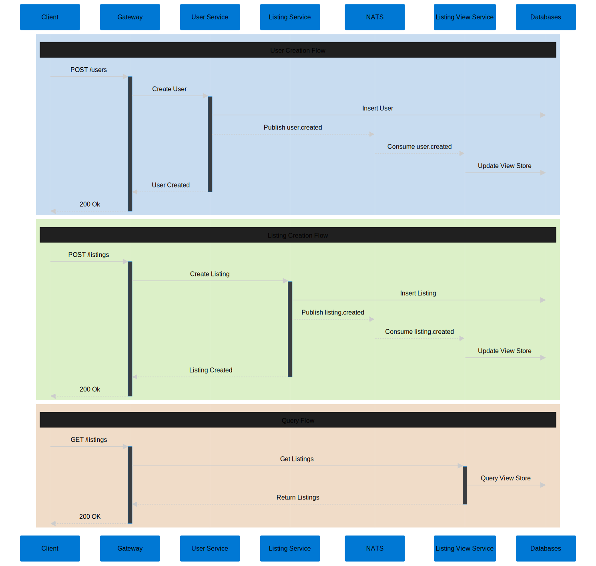

## Event Driven With NATS
This is simple project showcasing CQRS pattern in microservices. CQRS is not always related to event sourcing but we can also use this pattern to make dynamic projection model for our data.

## Prerequisites
- Go (in this project i use go v1.23.4)
- NATS with Jetstream as persistence (inside compose file)
- docker and docker compose
- Make to run `Makefile`

**NOTE:** For golang project i use vendorize dependency so we dont need to download dependency again, yes this is intentional.

## Running this project
- **All dockerfile for golang in this project is for development purpose**
- Run in three step
    - `make environment-all` to create .env , clean db, run container, build binary.
    - `make migrate-all` to run database migrataion for all service
    - `make run-all` run detached container for all service
- Specific command can be found in `Makefile`
- Generate api doc for `gateway service` using `make api-docs-gateway-service`
- Run unit test `run-unit-test-[service-name]` e.g. `run-unit-test-user-service`

## Assumptions
- The Listing service is designed to scale with different data projections and complex queries. This pattern accommodates future scalability needs.
- Real-time data updates are not critical for listing operations. However, fast access with complex queries is essential since we aggregate data from both listing and user services, justifying a separate service.
- The main trade-off of this pattern is eventual consistency, which is acceptable for our use case of displaying listings.

## Why NATS?
Actually this is my firstime using NATS but i see a lot benefit rather than other message broker platform. NATS was chosen over others like Kafka for this project for several reasons:

- Lightweight and simple to deploy, single binary with minimal configuration
- Low latency messaging (sub-millisecond)
- Built-in persistence with JetStream
- Native support for request-reply patterns
- Excellent for microservices due to built-in service discovery
- Smaller resource footprint (i run this in macbook air m1, no issue :D) 

## System Components
### High Level Diagram

### Container Diagram

### Sequence

Every service has it's own databse except `gateway-service` to simulate loose couple in microservice

#### 1. Gateway Service
- Acts as an API Gateway (BFF Pattern)
- Routes requests to appropriate services
- Handles client communication
- Uses HTTP for communication with other services

#### 2. User Service
- Manages user data
- PostgreSQL database
- Publishes `user.created` events to NATS
- Handles both HTTP and NATS communication

#### 3. Listing Service
- Manages listing data
- SQLite database
- Publishes `listing.created` events to NATS
- Handles both HTTP and NATS communication

#### 4. Listing View Service
- Consumes `user.creted`,`listing.created` event from NATS
- Maintains a read-optimized view of listings using denormalize method leveraging PostgreSQL jsonb
- PostgreSQL database
- Event-driven architecture

#### 5. Message Bus
- NATS JetStream
- Handles event distribution
- Provides persistence for events

## Architectural Patterns

#### Event-Driven Architecture
- Services communicate through events
- Loose coupling between services
- Asynchronous processing

#### CQRS (Command Query Responsibility Segregation)
- Separate write (Listing Service) and read (Listing View Service) models
- Optimized data models for different use cases

#### API Gateway Pattern
- Single entry point for clients
- Request routing
- Client-specific APIs

#### Repository Pattern
- Data access abstraction
- Database independence
- Transaction management

#### Clean Architecture
- Layered approach (Router → Endpoints → Service → Repository)
- Dependency injection
- Clear separation of concerns

# Limitation
- Compensation event or replying mechanism for fail message is not provided here (i will update in future)
- Unit & integration test still in progress
- OpenAPI doc still in progress

# Future Improvment
- Handling compensation event
- Distributed tracing is critical in microservice architecture, will add Grafana stack in this project
- CI pipeline